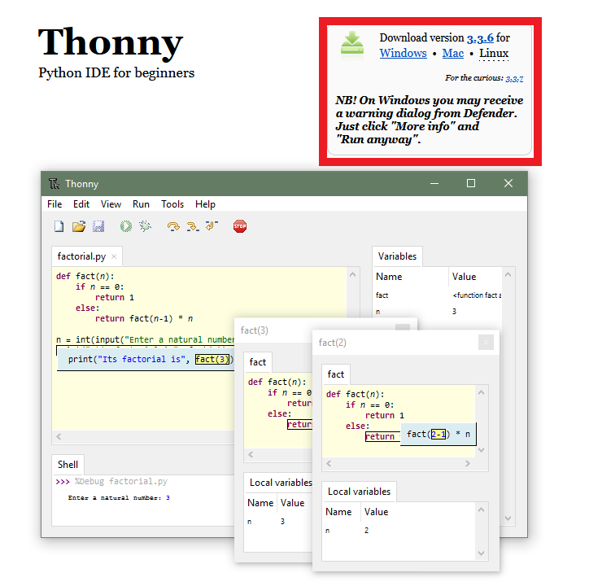
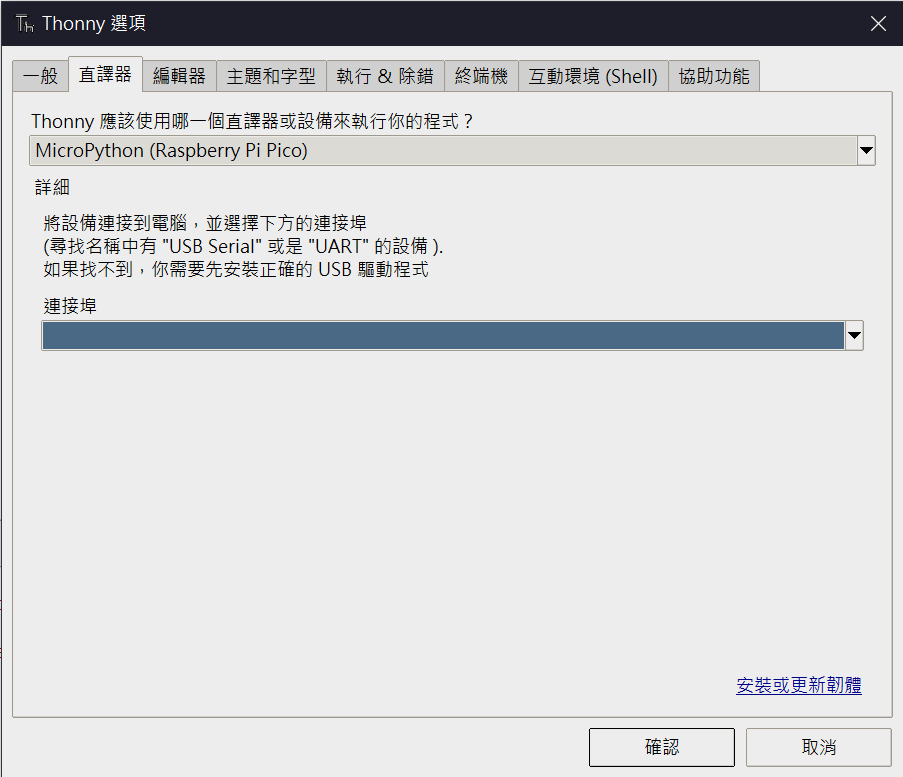
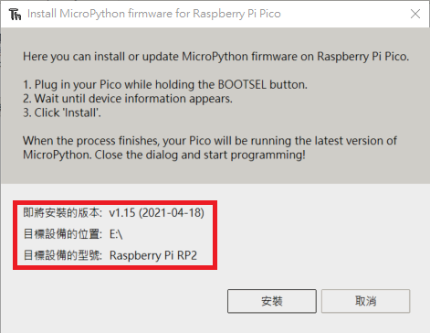

# Raspberry Pi Pico AM7020

## 使用元件
* [Raspberry Pi Pico](https://www.icshop.com.tw/product-page.php?28339)
* [Grove Shield for Pi Pico v1.0](https://www.icshop.com.tw/product-page.php?28406)
* [AM7020【贈FPC天線+排針】](https://www.icshop.com.tw/product-page.php?28187)
* [Circus SHT3x 溫溼度感測器模組](https://www.icshop.com.tw/product-page.php?27610)
* [Circus 1.3吋OLED顯示螢幕](https://www.icshop.com.tw/product-page.php?27896)
* [Grove 5條- 4pin連接線 20cm](https://www.icshop.com.tw/product-page.php?27146)
## 安裝Thonny IDE
1. 到[Thonny官網](https://thonny.org/)並依照自己的作業系統下載對應版本的Thonny  

2. 燒錄MicroPython韌體  
* 選擇工具>>選項>>直譯器，選擇MicroPython (Raspberry Pi Pico)，點擊安裝或更新韌體

* 按住Pico BOOTSEL按鍵，與電腦連接，出現目標設備型號後選擇安裝

## 安裝相關 Library
#### micropython-am7020 library可從[這裡](https://pypi.org/project/micropython-am7020/)取得  
1. 透過Thonny將[am7020](./am7020)與[libs](./libs)資料夾傳入Pi Pico
